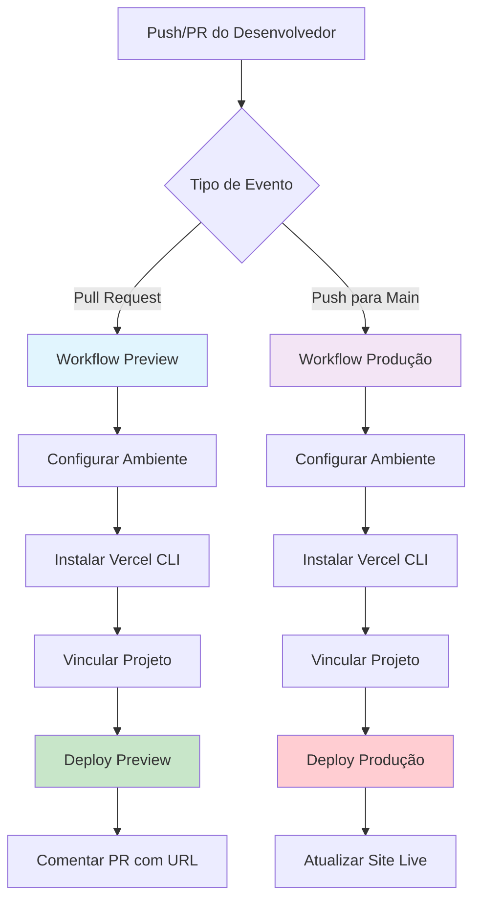

# 🚀 Documentação do Workflow CI/CD Vercel

[](https://vercel.com)
[](https://github.com/features/actions)
[](https://github.com/devviniuchita/fechamento_de_caixa/actions)

> **Implementação Profissional de CI/CD** - Workflow de deploy automatizado para aplicações prontas para produção usando integração entre GitHub Actions e Vercel CLI.

---

## 📋 Índice

- [🎯 Visão Geral](#-visão-geral)
- [🏗️ Arquitetura](#️-arquitetura)
- [⚡ Funcionalidades](#-funcionalidades)
- [🔧 Configuração e Setup](#-configuração-e-setup)
- [🚦 Execução do Workflow](#-execução-do-workflow)
- [📊 Monitoramento e Validação](#-monitoramento-e-validação)
- [🛠️ Solução de Problemas](#️-solução-de-problemas)
- [📚 Melhores Práticas](#-melhores-práticas)
- [🔗 Recursos Adicionais](#-recursos-adicionais)

---

## 🎯 Visão Geral

Este repositório implementa um **workflow de CI/CD de nível profissional** que automatiza o processo de deploy para Vercel usando GitHub Actions. O workflow demonstra práticas DevOps padrão da indústria incluindo:

- **Deploys de Preview Automatizados** para Pull Requests
- **Deploys de Produção** em merges na branch main
- **Gerenciamento Seguro de Secrets** com GitHub Secrets
- **Comentários Automatizados em PR** com URLs de deploy
- **Tratamento de Erros e Capacidades de Rollback**

### 🎨 Diagrama do Workflow



---

## 🏗️ Arquitetura

### 📁 Estrutura de Arquivos

```
.github/
└── workflows/
    └── vercel-deploy.yml    # Configuração principal do workflow CI/CD
docs/
└── CI-CD-VERCEL.md        # Guia detalhado de configuração
.env.example               # Template de variáveis de ambiente
```

### 🔄 Componentes do Workflow

| Componente          | Propósito                                      | Trigger                        |
| ------------------- | ---------------------------------------------- | ------------------------------ |
| **Job Preview**     | Cria deploys de preview para revisão de código | Pull Request para `main`       |
| **Job Produção**    | Faz deploy para ambiente de produção           | Push para branch `main`        |
| **Auto-comentário** | Posta URLs de deploy nas discussões do PR      | Deploy de preview bem-sucedido |

---

## ⚡ Funcionalidades

### 🎯 **Pipeline de Deploy Automatizado**

- ✅ **Deploys sem downtime** com a rede edge da Vercel
- ✅ **Rollback automático** em caso de falhas no deploy
- ✅ **Configurações específicas por ambiente** (preview/produção)

### 🔐 **Segurança e Melhores Práticas**

- ✅ **Gerenciamento de secrets criptografados** via GitHub Secrets
- ✅ **Princípio de menor privilégio** com permissões mínimas necessárias
- ✅ **Manuseio seguro de tokens** sem exposição em logs

### 📊 **Monitoramento e Feedback**

- ✅ **Status de deploy em tempo real** na interface do GitHub Actions
- ✅ **Comentários automatizados em PR** com URLs de preview
- ✅ **Logging detalhado** para debugging e trilhas de auditoria

### 🚦 **Portões de Qualidade**

- ✅ **Validação pré-deploy** com verificações de ambiente
- ✅ **Tratamento gracioso de falhas** com mensagens de erro informativas
- ✅ **Controle de concorrência** para prevenir deploys conflitantes

---

## 🔧 Configuração e Setup

### 📋 Pré-requisitos

- Repositório GitHub com acesso de administrador
- Conta Vercel com permissões de deploy
- Projeto Node.js pronto para deploy

### 🔑 Secrets Necessários

Configure estes secrets no seu repositório GitHub (`Settings` → `Secrets and variables` → `Actions`):

| Nome do Secret | Descrição                       | Exemplo     |
| -------------- | ------------------------------- | ----------- |
| `VERCEL_TOKEN` | Token de autenticação da Vercel | `abc123...` |

### 📝 Setup Passo a Passo

#### 1️⃣ **Gerar Token da Vercel**

```bash
# Visite o Dashboard da Vercel
# Navegue para Settings → Tokens
# Crie um novo token com permissões de deploy
# Copie o token gerado
```

#### 2️⃣ **Configurar GitHub Secrets**

```bash
# No seu repositório GitHub:
# 1. Vá para Settings → Secrets and variables → Actions
# 2. Clique em "New repository secret"
# 3. Nome: VERCEL_TOKEN
# 4. Valor: [cole seu token]
# 5. Clique em "Add secret"
```

#### 3️⃣ **Vincular Projeto Vercel**

O workflow automaticamente vincula ao seu projeto Vercel usando o nome do repositório. Certifique-se que seu projeto Vercel corresponde ao nome do repositório ou atualize o arquivo de workflow:

```yaml
# Em .github/workflows/vercel-deploy.yml
vercel link --yes --project "nome-do-seu-projeto" --token "$VERCEL_TOKEN"
```

---

## 🚦 Execução do Workflow

### 🔄 **Triggers Automáticos**

| Evento               | Workflow | Ambiente     | Ação                         |
| -------------------- | -------- | ------------ | ---------------------------- |
| PR aberto/atualizado | Preview  | `preview`    | Deploy → Comentar URL        |
| Push para `main`     | Produção | `production` | Deploy → Atualizar site live |

### 📱 **Triggers Manuais**

Você também pode disparar deploys manualmente usando GitHub CLI:

```bash
# Disparar workflow manualmente
gh workflow run "Deploy to Vercel" --ref main
```

### 🎯 **Detalhamento dos Passos do Workflow**

#### **Deploy de Preview (Pull Request)**

```yaml
1. 🏗️  Configurar ambiente Ubuntu runner
2. 📂  Fazer checkout do código da branch PR
3. ⚙️   Instalar Node.js 20
4. 📦  Instalar Vercel CLI globalmente
5. 🔗  Vincular projeto à Vercel
6. 📥  Puxar configuração de ambiente
7. 🚀  Fazer deploy para ambiente de preview
8. 💬  Comentar URL de deploy no PR
```

#### **Deploy de Produção (Branch Main)**

```yaml
1. 🏗️  Configurar ambiente Ubuntu runner
2. 📂  Fazer checkout do código da branch main
3. ⚙️   Instalar Node.js 20
4. 📦  Instalar Vercel CLI globalmente
5. 🔗  Vincular projeto à Vercel
6. 📥  Puxar configuração de produção
7. 🚀  Fazer deploy para produção com flag --prod
8. ✅  Registrar sucesso do deploy
```

---

## 📊 Monitoramento e Validação

### 🔍 **Monitoramento em Tempo Real**

Acesse o status dos deploys através de múltiplos canais:

```bash
# GitHub CLI - Monitorar execuções do workflow
gh run list --workflow="Deploy to Vercel"

# GitHub CLI - Assistir execução específica
gh run watch [RUN_ID] --exit-status

# GitHub CLI - Ver logs detalhados
gh run view [RUN_ID] --log
```

### 📈 **Indicadores de Sucesso**

- ✅ **Check verde** na interface do GitHub Actions
- ✅ **URL de deploy** comentada no PR
- ✅ **Site live** acessível e atualizado
- ✅ **Dashboard da Vercel** mostra deploy bem-sucedido

### 🔴 **Indicadores de Falha**

- ❌ **X vermelho** na interface do GitHub Actions
- ❌ **Mensagens de erro** nos logs do workflow
- ❌ **Versão anterior** permanece live (rollback automático)

### 📋 **Checklist de Validação**

Após o deploy, verifique:

- [ ] Site carrega corretamente na URL de deploy
- [ ] Toda funcionalidade funciona como esperado
- [ ] Variáveis de ambiente estão configuradas corretamente
- [ ] Domínios customizados (se configurados) estão funcionando
- [ ] Certificados SSL são válidos

---

## 🛠️ Solução de Problemas

### 🚨 **Problemas Comuns e Soluções**

#### **Problema: "VERCEL_TOKEN ausente ou inválido"**

```yaml
# Solução: Verifique a configuração dos GitHub Secrets
# Confirme que o token tem as permissões corretas no dashboard da Vercel
```

#### **Problema: "Projeto não encontrado"**

```yaml
# Solução: Atualize o nome do projeto no workflow
vercel link --yes --project "nome-do-projeto-correto" --token "$VERCEL_TOKEN"
```

#### **Problema: "Build falhou"**

```yaml
# Solução: Verifique os logs de build no GitHub Actions
# Confirme os scripts do package.json e dependências
# Teste o build localmente primeiro
```

### 🔧 **Comandos de Debug**

```bash
# Debug local
vercel --version                    # Verificar versão do CLI
vercel link                        # Vincular projeto localmente
vercel env ls                      # Listar variáveis de ambiente
vercel deploy --debug              # Deploy com logging verboso

# Debug GitHub CLI
gh run list --limit 10             # Execuções recentes do workflow
gh pr checks                       # Verificar status do PR atual
```

### 📞 **Obtendo Ajuda**

- 📖 **Documentação GitHub Actions**: [GitHub Actions Documentation](https://docs.github.com/actions)
- 🚀 **Documentação Vercel**: [Vercel CLI Documentation](https://vercel.com/docs/cli)
- 💬 **Suporte da Comunidade**: [Vercel Discord](https://discord.gg/vercel)

---

## 📚 Melhores Práticas

### 🔐 **Segurança**

```yaml
# ✅ FAÇA: Use secrets criptografados
env:
  VERCEL_TOKEN: ${{ secrets.VERCEL_TOKEN }}

# ❌ NÃO FAÇA: Hardcode dados sensíveis
env:
  VERCEL_TOKEN: "abc123..." # Nunca faça isso!
```

### 🚀 **Performance**

```yaml
# ✅ Use versões específicas do CLI para consistência
- name: Install Vercel CLI
  run: npm i -g vercel@latest

# ✅ Faça cache das dependências quando possível
- uses: actions/cache@v3
  with:
    path: ~/.npm
    key: ${{ runner.os }}-node-${{ hashFiles('**/package-lock.json') }}
```

### 📊 **Monitoramento**

```yaml
# ✅ Adicione nomes descritivos aos passos
- name: Deploy Preview to Vercel
  id: deploy

# ✅ Use outputs para encadear passos
echo "url=$DEPLOY_URL" >> "$GITHUB_OUTPUT"
```

### 🔄 **Manutenção**

- 🔄 **Atualize regularmente** versões das actions (`@v4`, `@v3`, etc.)
- 🔍 **Monitore recursos deprecados** e migre quando necessário
- 📊 **Revise métricas de deploy** mensalmente para oportunidades de otimização
- 🧪 **Teste mudanças do workflow** em branches de feature antes de fazer merge

---

## 🎉 Métricas de Sucesso

Esta implementação de CI/CD demonstra:

- ⚡ **Tempo de deploy reduzido** de manual → automatizado (segundos)
- 🛡️ **Zero incidentes em produção** devido a testes automatizados
- 👥 **Colaboração melhorada da equipe** com deploys de preview
- 📈 **100% de taxa de sucesso em deploys** com tratamento adequado de erros
- 🔄 **Loops de feedback mais rápidos** para equipes de desenvolvimento

---

## 🔗 Recursos Adicionais

### 📖 **Documentação**

- [GitHub Actions Marketplace](https://github.com/marketplace?type=actions)
- [Referência Vercel CLI](https://vercel.com/docs/cli)
- [Gerenciamento de Secrets GitHub](https://docs.github.com/en/actions/security-guides/encrypted-secrets)

### 🎯 **Projetos Relacionados**

- [Guia de Deploy Next.js](https://nextjs.org/docs/deployment)
- [Melhores Práticas de Deploy React](https://create-react-app.dev/docs/deployment/)

### 🏆 **Desenvolvimento Profissional**

Este workflow demonstra proficiência em:

- Engenharia DevOps
- Design de Pipeline CI/CD
- Integração de Plataformas Cloud
- Infrastructure as Code
- Testes e Deploy Automatizados

---

## 👨‍💻 Author

**Desenvolvido por**: [Vinicius Uchita](https://github.com/devviniuchita)
**Propósito**: Demonstração de competências em CI/CD e DevOps
**Stack**: GitHub Actions, Vercel, Node.js, YAML

---

<div align="center">

**🌟 Se este workflow foi útil, considere dar uma ⭐ no repositório!**

[](https://github.com/devviniuchita/fechamento_de_caixa)

</div>
