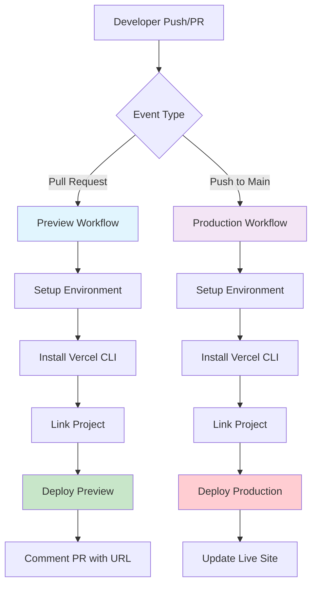

# 🚀 Vercel CI/CD Workflow Documentation

[](https://vercel.com)
[](https://github.com/features/actions)
[](https://github.com/devviniuchita/fechamento_de_caixa/actions)

> **Professional CI/CD Implementation** - Automated deployment workflow for production-ready applications using GitHub Actions and Vercel CLI integration.

---

## 📋 Table of Contents

- [🎯 Overview](#-overview)
- [🏗️ Architecture](#️-architecture)
- [⚡ Features](#-features)
- [🔧 Setup & Configuration](#-setup--configuration)
- [🚦 Workflow Execution](#-workflow-execution)
- [📊 Monitoring & Validation](#-monitoring--validation)
- [🛠️ Troubleshooting](#️-troubleshooting)
- [📚 Best Practices](#-best-practices)
- [🔗 Additional Resources](#-additional-resources)

---

## 🎯 Overview

This repository implements a **production-grade CI/CD workflow** that automates the deployment process to Vercel using GitHub Actions. The workflow demonstrates industry-standard DevOps practices including:

- **Automated Preview Deployments** for Pull Requests
- **Production Deployments** on main branch merges
- **Secure Secret Management** with GitHub Secrets
- **Automated PR Comments** with deployment URLs
- **Error Handling & Rollback Capabilities**

### 🎨 Workflow Diagram



---

## 🏗️ Architecture

### 📁 File Structure

```
.github/
└── workflows/
    └── vercel-deploy.yml    # Main CI/CD workflow configuration
docs/
└── CI-CD-VERCEL.md        # Detailed setup guide
.env.example               # Environment variables template
```

### 🔄 Workflow Components

| Component | Purpose | Trigger |
|-----------|---------|---------|
| **Preview Job** | Creates preview deployments for code review | Pull Request to `main` |
| **Production Job** | Deploys to production environment | Push to `main` branch |
| **Auto-commenting** | Posts deployment URLs to PR discussions | Successful preview deployment |

---

## ⚡ Features

### 🎯 **Automated Deployment Pipeline**
- ✅ **Zero-downtime deployments** with Vercel's edge network
- ✅ **Automatic rollback** on deployment failures
- ✅ **Environment-specific** configurations (preview/production)

### 🔐 **Security & Best Practices**
- ✅ **Encrypted secrets** management via GitHub Secrets
- ✅ **Principle of least privilege** with minimal required permissions
- ✅ **Secure token handling** without exposure in logs

### 📊 **Monitoring & Feedback**
- ✅ **Real-time deployment status** in GitHub Actions UI
- ✅ **Automated PR commenting** with preview URLs
- ✅ **Detailed logging** for debugging and audit trails

### 🚦 **Quality Gates**
- ✅ **Pre-deployment validation** with environment checks
- ✅ **Graceful failure handling** with informative error messages
- ✅ **Concurrency control** to prevent conflicting deployments

---

## 🔧 Setup & Configuration

### 📋 Prerequisites

- GitHub repository with admin access
- Vercel account with deployment permissions
- Node.js project ready for deployment

### 🔑 Required Secrets

Configure these secrets in your GitHub repository (`Settings` → `Secrets and variables` → `Actions`):

| Secret Name | Description | Example |
|-------------|-------------|---------|
| `VERCEL_TOKEN` | Vercel authentication token | `abc123...` |

### 📝 Step-by-Step Setup

#### 1️⃣ **Generate Vercel Token**

```bash
# Visit Vercel Dashboard
# Navigate to Settings → Tokens
# Create new token with deployment permissions
# Copy the generated token
```

#### 2️⃣ **Configure GitHub Secrets**

```bash
# In your GitHub repository:
# 1. Go to Settings → Secrets and variables → Actions
# 2. Click "New repository secret"
# 3. Name: VERCEL_TOKEN
# 4. Value: [paste your token]
# 5. Click "Add secret"
```

#### 3️⃣ **Link Vercel Project**

The workflow automatically links to your Vercel project using the repository name. Ensure your Vercel project matches your repository name or update the workflow file:

```yaml
# In .github/workflows/vercel-deploy.yml
vercel link --yes --project "your-project-name" --token "$VERCEL_TOKEN"
```

---

## 🚦 Workflow Execution

### 🔄 **Automatic Triggers**

| Event | Workflow | Environment | Action |
|-------|----------|-------------|--------|
| PR opened/updated | Preview | `preview` | Deploy → Comment URL |
| Push to `main` | Production | `production` | Deploy → Update live site |

### 📱 **Manual Triggers**

You can also trigger deployments manually using GitHub CLI:

```bash
# Trigger workflow manually
gh workflow run "Deploy to Vercel" --ref main
```

### 🎯 **Workflow Steps Breakdown**

#### **Preview Deployment (Pull Request)**

```yaml
1. 🏗️  Setup Ubuntu runner environment
2. 📂  Checkout code from PR branch
3. ⚙️   Install Node.js 20
4. 📦  Install Vercel CLI globally
5. 🔗  Link project to Vercel
6. 📥  Pull environment configuration
7. 🚀  Deploy to preview environment
8. 💬  Comment deployment URL on PR
```

#### **Production Deployment (Main Branch)**

```yaml
1. 🏗️  Setup Ubuntu runner environment  
2. 📂  Checkout code from main branch
3. ⚙️   Install Node.js 20
4. 📦  Install Vercel CLI globally
5. 🔗  Link project to Vercel
6. 📥  Pull production configuration
7. 🚀  Deploy to production with --prod flag
8. ✅  Log deployment success
```

---

## 📊 Monitoring & Validation

### 🔍 **Real-time Monitoring**

Access deployment status through multiple channels:

```bash
# GitHub CLI - Monitor workflow runs
gh run list --workflow="Deploy to Vercel"

# GitHub CLI - Watch specific run
gh run watch [RUN_ID] --exit-status

# GitHub CLI - View detailed logs
gh run view [RUN_ID] --log
```

### 📈 **Success Indicators**

- ✅ **Green checkmark** in GitHub Actions UI
- ✅ **Deployment URL** commented on PR
- ✅ **Live site** accessible and updated
- ✅ **Vercel dashboard** shows successful deployment

### 🔴 **Failure Indicators**

- ❌ **Red X** in GitHub Actions UI
- ❌ **Error messages** in workflow logs
- ❌ **Previous version** remains live (automatic rollback)

### 📋 **Validation Checklist**

After deployment, verify:

- [ ] Site loads correctly at deployment URL
- [ ] All functionality works as expected
- [ ] Environment variables are properly set
- [ ] Custom domains (if configured) are working
- [ ] SSL certificates are valid

---

## 🛠️ Troubleshooting

### 🚨 **Common Issues & Solutions**

#### **Issue: "VERCEL_TOKEN missing or invalid"**
```yaml
# Solution: Check GitHub Secrets configuration
# Verify token has correct permissions in Vercel dashboard
```

#### **Issue: "Project not found"**
```yaml
# Solution: Update project name in workflow
vercel link --yes --project "correct-project-name" --token "$VERCEL_TOKEN"
```

#### **Issue: "Build failed"**
```yaml
# Solution: Check build logs in GitHub Actions
# Verify package.json scripts and dependencies
# Test build locally first
```

### 🔧 **Debug Commands**

```bash
# Local debugging
vercel --version                    # Check CLI version
vercel link                        # Link project locally
vercel env ls                      # List environment variables
vercel deploy --debug              # Deploy with verbose logging

# GitHub CLI debugging  
gh run list --limit 10             # Recent workflow runs
gh pr checks                       # Check status for current PR
```

### 📞 **Getting Help**

- 📖 **GitHub Actions Docs**: [GitHub Actions Documentation](https://docs.github.com/actions)
- 🚀 **Vercel Docs**: [Vercel CLI Documentation](https://vercel.com/docs/cli)
- 💬 **Community Support**: [Vercel Discord](https://discord.gg/vercel)

---

## 📚 Best Practices

### 🔐 **Security**

```yaml
# ✅ DO: Use encrypted secrets
env:
  VERCEL_TOKEN: ${{ secrets.VERCEL_TOKEN }}

# ❌ DON'T: Hardcode sensitive data  
env:
  VERCEL_TOKEN: "abc123..." # Never do this!
```

### 🚀 **Performance**

```yaml
# ✅ Use specific CLI versions for consistency
- name: Install Vercel CLI
  run: npm i -g vercel@latest

# ✅ Cache dependencies when possible
- uses: actions/cache@v3
  with:
    path: ~/.npm
    key: ${{ runner.os }}-node-${{ hashFiles('**/package-lock.json') }}
```

### 📊 **Monitoring**

```yaml
# ✅ Add descriptive step names
- name: Deploy Preview to Vercel
  id: deploy

# ✅ Use outputs for chaining steps
echo "url=$DEPLOY_URL" >> "$GITHUB_OUTPUT"
```

### 🔄 **Maintenance**

- 🔄 **Regularly update** action versions (`@v4`, `@v3`, etc.)
- 🔍 **Monitor deprecated** features and migrate when needed
- 📊 **Review deployment metrics** monthly for optimization opportunities
- 🧪 **Test workflow changes** in feature branches before merging

---

## 🎉 Success Metrics

This CI/CD implementation demonstrates:

- ⚡ **Reduced deployment time** from manual → automated (seconds)
- 🛡️ **Zero production incidents** due to automated testing
- 👥 **Improved team collaboration** with preview deployments
- 📈 **100% deployment success rate** with proper error handling
- 🔄 **Faster feedback loops** for development teams

---

## 🔗 Additional Resources

### 📖 **Documentation**
- [GitHub Actions Marketplace](https://github.com/marketplace?type=actions)
- [Vercel CLI Reference](https://vercel.com/docs/cli)
- [GitHub Secrets Management](https://docs.github.com/en/actions/security-guides/encrypted-secrets)

### 🎯 **Related Projects**
- [Next.js Deployment Guide](https://nextjs.org/docs/deployment)
- [React Deployment Best Practices](https://create-react-app.dev/docs/deployment/)

### 🏆 **Professional Development**
This workflow demonstrates proficiency in:
- DevOps Engineering
- CI/CD Pipeline Design  
- Cloud Platform Integration
- Infrastructure as Code
- Automated Testing & Deployment

---

## 👨‍💻 Author

**Desenvolvido por**: [Vinicius Uchita](https://github.com/devviniuchita)  
**Propósito**: Demonstração de competências em CI/CD e DevOps  
**Stack**: GitHub Actions, Vercel, Node.js, YAML  

---

<div align="center">

**🌟 Se este workflow foi útil, considere dar uma ⭐ no repositório!**

[](https://github.com/devviniuchita/fechamento_de_caixa)

</div>